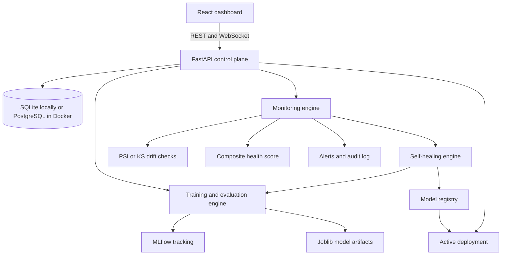

# SentinelML Project Documentation

## 1. What SentinelML Is

SentinelML is a self-healing MLOps platform for a fraud-detection machine-learning model. It demonstrates the complete production lifecycle of a model:

```text
Validate data -> Train -> Track -> Register -> Deploy -> Predict -> Monitor
     ^                                                        |
     |                                                        v
     +----------- Detect drift or degradation <- Recover <- Rollback
```

The project is designed as a portfolio and learning system. It focuses on making MLOps concepts visible and testable through a web dashboard rather than building a large distributed production service.

The central idea is that a machine-learning model should not be treated as finished after training. Once deployed, it must be observed continuously. If data changes, prediction quality falls, latency increases, or errors become excessive, SentinelML can trigger a recovery workflow that trains and evaluates a challenger model. A challenger is promoted only when it meets the configured quality and latency rules. If the deployed model becomes unhealthy, the previous champion can be restored automatically.

## 2. Main Capabilities

SentinelML provides:

- Dataset upload, validation, versioning, and reference-dataset selection.
- A built-in demo fraud dataset that can be loaded from the Datasets page without uploading a file.
- Training of Logistic Regression, Random Forest, SVM, and XGBoost when available.
- Evaluation using accuracy, precision, recall, F1, ROC AUC, PR AUC, training time, and inference latency.
- MLflow experiment tracking for parameters, metrics, and dataset version tags.
- Model artifact storage using joblib files.
- A model registry with candidate, champion, challenger, archived, and rejected states.
- Model deployment and prediction serving through FastAPI.
- Prediction logging for latency, probability, inputs, errors, and optional ground truth.
- Data drift detection using PSI or KS statistical methods.
- Production performance monitoring based on predictions with known labels.
- Composite model-health scoring.
- Alerts, audit records, and real-time WebSocket events.
- Failure simulation for drift, degradation, latency, and errors.
- Automated self-healing, model promotion, and rollback.
- SHAP-based or model-specific explainability for supported models.
- A React and TypeScript dashboard for operating the platform.

## 3. High-Level Architecture



### Runtime services

**Frontend:** React 18, TypeScript, Vite, Tailwind CSS, Recharts, React Router, and Lucide icons. It presents pages for overview, models, experiments, datasets, monitoring, alerts, recovery, audit history, and settings.

**Backend:** FastAPI exposes versioned REST endpoints under `/api/v1`, plus `/health` for readiness checks and a WebSocket endpoint for live events.

**Database:** SQLAlchemy persists datasets, training runs, model versions, prediction logs, alerts, audit entries, recovery workflows, and small pieces of system state. Local development uses SQLite. Docker Compose supplies PostgreSQL.

**MLflow:** Training runs log model parameters, evaluation metrics, dataset versions, and trigger source. Local development uses a file-based MLflow store.

**Artifact storage:** Trained model and scaler objects are saved as joblib files under the configured model store directory. The database stores the artifact path in each model version.

## 4. End-to-End Model Lifecycle

### 4.1 Dataset ingestion and validation

1. A user uploads a CSV file from the Datasets page.
2. The API stores the file in the configured data directory.
3. The dataset service reads the file and inspects its schema.
4. The target column is checked, numeric features are identified, and basic quality information is recorded.
5. A dataset version is created in the database.
6. A valid dataset can act as the reference dataset for future drift comparisons.

The checked-in sample file is `ml/datasets/samples/transactions.csv` and uses `fraud` as its target column.

### 4.2 Training and evaluation

A training request supplies a dataset ID and one or more model types. Each selected model runs through this sequence:

1. Load the dataset.
2. Remove rows with a missing target.
3. Select numeric feature columns and fill missing feature values with zero.
4. Split the data into training and test sets using a fixed random seed.
5. Fit a `StandardScaler` on training data and transform both partitions.
6. Train the selected estimator.
7. Calculate classification metrics and inference latency.
8. Log parameters and metrics to MLflow.
9. Save the estimator, scaler, and feature names as one joblib artifact.
10. Persist the training run and create a candidate model version.
11. Broadcast training events and write an audit entry.

Training supports these model types:

- `logistic_regression`
- `random_forest`
- `svm`
- `xgboost`, if the XGBoost package is installed

A training run has a status such as `RUNNING`, `COMPLETED`, `FAILED`, or `TIMEOUT`. Multiple models submitted together share a run-group ID, which lets the Experiments page compare them as one experiment.

### 4.3 Model registry and promotion

Every successful training run creates a model version for the `fraud-detector` model. A version contains its metric values, dataset version, training-run link, artifact path, and lifecycle state.

The normal states are:

```text
CANDIDATE -> CHAMPION -> ARCHIVED
                 |
                 +-> deployed
```

A candidate becomes the champion when it passes the promotion policy. The default policy compares F1 and requires at least a `0.02` improvement over the current champion. A latency increase above the configured limit can prevent promotion. When a new model is promoted, the former champion is archived and the new model is deployed.

### 4.4 Prediction serving

The `/api/v1/predict` endpoint accepts a feature dictionary. The predictor:

1. Finds the deployed champion.
2. Loads the model artifact and scaler.
3. Arranges incoming values using the feature names saved during training.
4. Applies the scaler and generates a prediction and probability.
5. Measures inference latency.
6. Writes a `PredictionLog` record.
7. Returns the prediction, probability, model version, and latency.

Prediction logs are essential because they provide the production sample used by drift, performance, latency, and error monitoring.

## 5. Monitoring and Health

### 5.1 Drift monitoring

The reference dataset is the baseline. Recent production prediction inputs are collected from prediction logs, normally using the latest 300 records. The target column is removed from the reference frame before comparison.

SentinelML can calculate drift using:

- **PSI:** compares the distribution of reference and current values across bins.
- **KS:** compares the empirical distributions using the Kolmogorov-Smirnov statistic.

The drift report returns a method, overall status, calculation timestamp, and per-feature results. A feature can be classified as normal, warning, or critical based on the configured warning and critical thresholds. When there is no reference data or no production traffic, the API returns a normal report with no feature results because there is nothing to compare.

### 5.2 Performance monitoring

Performance monitoring uses prediction logs that contain ground-truth labels. It compares the recent production metric with the champion baseline. The report includes baseline F1, current F1, sample size, and percentage degradation. With no labeled production data, current performance remains unavailable rather than being fabricated.

### 5.3 Latency and errors

The overview calculates average latency from recent prediction logs. Each prediction also records an error status, allowing error-rate checks. The monitoring system can use excessive latency or errors as a health signal and as a rollback condition.

### 5.4 Composite health score

The health service combines several dimensions:

- Performance
- Data quality
- Drift
- Latency
- Prediction errors

The result contains an overall score from 0 to 100 and a status such as `HEALTHY`, `WARNING`, or `CRITICAL`. The Overview and Monitoring pages display both the overall score and its component values.

## 6. Self-Healing and Rollback

### 6.1 Self-healing workflow

A monitoring condition or simulation endpoint can trigger self-healing. The engine persists and broadcasts each stage:

```text
DETECTED
  -> DIAGNOSING
  -> RETRAINING
  -> EVALUATING
  -> PROMOTED and DEPLOYED
     or REJECTED
```

The engine performs the following work:

1. Check the per-trigger retraining cooldown.
2. Record a recovery workflow with the current champion.
3. Diagnose and confirm that retraining is warranted.
4. Train a challenger, normally using the champion's model type.
5. Select the best successful challenger by the configured promotion metric.
6. Compare challenger metrics and latency with the champion.
7. Promote and deploy the challenger if approved.
8. Reject it and record the reason if it fails the policy.
9. Write alerts and audit records.
10. Broadcast recovery updates over WebSocket.

### 6.2 Rollback

Rollback protects production when the deployed model becomes unhealthy. The rollback policy uses the configured maximum error rate and minimum health score. When a rollback condition is met, the most recently archived healthy champion is restored and the event is recorded for auditability.

Manual rollback is also available from the Models page and the model API.

## 7. Real-Time Events

The backend event bus exposes `/api/v1/ws/events`. The frontend connects through `useLiveEvents`, maintains a live/offline state, reconnects after disconnects, and dispatches events to interested pages.

Typical event types include:

- `training_started`
- `training_completed`
- `training_failed`
- `alert`
- `recovery_update`
- Monitoring or system state updates where emitted by the backend

The WebSocket is for responsiveness and visibility. REST endpoints remain the source of truth for page data and can be refreshed independently.

## 8. Database Entities

The main SQLAlchemy tables are:

| Entity | Purpose |
|---|---|
| `datasets` | File metadata, schema, quality report, version, and reference status |
| `training_runs` | Model type, trigger source, MLflow ID, parameters, metrics, and status |
| `model_versions` | Registry state, artifact path, dataset link, metrics, and deployment status |
| `prediction_logs` | Inputs, outputs, probability, latency, error state, and optional truth label |
| `alerts` | Severity, description, source, open/acknowledged/resolved state |
| `audit_log` | Immutable-style operational history for important actions |
| `recovery_workflows` | Self-healing status, champion/challenger versions, outcome, and ordered log |
| `system_state` | Small global values such as active model or last check metadata |

## 9. Dashboard Pages

- **Overview:** Overall health, active model, drift, performance, latency, prediction volume, and open alerts.
- **Models:** Browse model versions, inspect metrics and lineage, deploy models, and roll back.
- **Experiments:** Compare training runs and their metrics.
- **Datasets:** Upload datasets, inspect validation details, and start training.
- **Monitoring:** Inspect detailed drift and performance reports and run failure simulations.
- **Alerts:** Review, acknowledge, and resolve monitoring or recovery alerts.
- **Recovery:** Follow self-healing workflows and their step-by-step logs.
- **Audit Log:** Review operational events for traceability.
- **Settings:** Read and update runtime thresholds and monitoring configuration.

## 10. API Surface

### System

- `GET /health` - Database-backed readiness and active-model status.
- `GET /` - Basic service information and links to docs.
- `WS /api/v1/ws/events` - Live event stream.

### Datasets and training

- `GET /api/v1/datasets`
- `GET /api/v1/datasets/{dataset_id}`
- `POST /api/v1/datasets/upload`
- `POST /api/v1/datasets/default` - Load the built-in demo dataset
- `POST /api/v1/training/start`
- `GET /api/v1/training`
- `GET /api/v1/training/{run_id}`

### Models and predictions

- `GET /api/v1/models`
- `GET /api/v1/models/{model_id}`
- `GET /api/v1/models/{model_id}/lineage`
- `POST /api/v1/models/{model_id}/deploy`
- `POST /api/v1/models/{model_id}/rollback`
- `GET /api/v1/models/{model_id}/explainability/global`
- `POST /api/v1/models/{model_id}/explainability/predict`
- `POST /api/v1/predict`

### Monitoring and operations

- `GET /api/v1/monitoring/overview`
- `GET /api/v1/monitoring/drift?method=psi`
- `GET /api/v1/monitoring/performance`
- `GET /api/v1/alerts`
- `POST /api/v1/alerts/{alert_id}/acknowledge`
- `POST /api/v1/alerts/{alert_id}/resolve`
- `GET /api/v1/audit-log`
- `GET /api/v1/recovery`
- `GET /api/v1/recovery/{workflow_id}`
- `POST /api/v1/simulation/drift`
- `POST /api/v1/simulation/degradation`
- `POST /api/v1/simulation/latency`
- `POST /api/v1/simulation/errors`
- `GET /api/v1/config`
- `PATCH /api/v1/config`

Interactive OpenAPI documentation is available at `/docs` while the backend is running.

## 11. Configuration

Configuration is centralized in `backend/app/core/config.py` and can be overridden through `.env` values. Important settings include:

| Setting | Default purpose |
|---|---|
| `DATABASE_URL` | SQLite locally; PostgreSQL in Docker |
| `MLFLOW_TRACKING_URI` | Local file-based tracking by default |
| `DATA_DIR` | Dataset storage location |
| `MODEL_STORE_DIR` | Joblib artifact location |
| `CORS_ALLOWED_ORIGINS` | Browser origins allowed to call the API |
| `MONITORING_INTERVAL_SECONDS` | Background monitoring interval, default 60 seconds |
| `DRIFT_WARNING_THRESHOLD` | Drift warning boundary, default 0.10 |
| `DRIFT_CRITICAL_THRESHOLD` | Drift critical boundary, default 0.25 |
| `PROMOTION_MIN_IMPROVEMENT` | Required metric improvement, default 0.02 |
| `PROMOTION_MAX_LATENCY_INCREASE_PCT` | Maximum allowed latency regression |
| `ROLLBACK_MAX_ERROR_RATE` | Error-rate rollback boundary |
| `ROLLBACK_MIN_HEALTH_SCORE` | Minimum health score before rollback |
| `TRAINING_TIMEOUT_SECONDS` | Maximum training duration |
| `RETRAINING_COOLDOWN_SECONDS` | Duplicate-trigger suppression window |
| `RATE_LIMIT_PREDICT_PER_MINUTE` | Prediction request limit |
| `RATE_LIMIT_SIMULATION_PER_MINUTE` | Simulation request limit |

Do not use the default development `SECRET_KEY` in a public deployment. Authentication is intentionally outside the current portfolio scope.

## 12. Running the Project

### Local development

Backend on Windows PowerShell:

```powershell
cd backend
.\.venv\Scripts\Activate.ps1
pip install -r requirements.txt
$env:PYTHONPATH = (Get-Location).Path
uvicorn app.main:app --reload --port 8000
```

Frontend:

```powershell
cd frontend
npm install
npm run dev
```

Open:

- Dashboard: `http://localhost:5173`
- API docs: `http://localhost:8000/docs`
- Health check: `http://localhost:8000/health`

Local mode uses SQLite and a local MLflow file store. Docker is not required.

### Docker Compose

The Compose setup provides:

- PostgreSQL on port 5432.
- MLflow on port 5000.
- Backend on port 8000.
- Frontend on port 5173.

Start it with:

```bash
docker compose up --build
```

Docker mode is closer to the intended multi-service demonstration environment, while local mode is simpler for development and debugging.

## 13. Recommended Demonstration Flow

1. Open the Datasets page.
2. Upload `ml/datasets/samples/transactions.csv` and enter `fraud` as the target column.
3. Start training with several algorithms.
4. Compare completed experiments and find the strongest F1 score.
5. Deploy the chosen model from the Models page.
6. Send predictions or use the prediction workflow to create production logs.
7. Inspect the Monitoring page.
8. Run a drift or degradation simulation.
9. Watch the Recovery page for detection, retraining, evaluation, and promotion or rejection.
10. Review resulting Alerts and Audit Log entries.
11. Inspect model lineage and, when appropriate, demonstrate rollback.

The dashboard can initially show no model and no production traffic. That is expected: monitoring becomes informative after a dataset is uploaded, a model is trained and deployed, and predictions have been logged.

## 14. Testing

The backend test suite is under `backend/tests` and covers:

- API behavior.
- Dataset versioning.
- Data validation.
- Drift calculations.
- Health scoring.
- Promotion rules.
- Rollback behavior.
- Self-healing workflows.

Run it with:

```bash
cd backend
pytest -v
```

The frontend build verifies TypeScript compilation and Vite bundling:

```bash
cd frontend
npm run build
```

## 15. Important Design Decisions

- **Simple local operation:** SQLite and file-based MLflow avoid requiring external services during development.
- **Transparent monitoring:** PSI, KS, and explicit health components make decisions understandable.
- **Persisted workflows:** Recovery progress is stored in the database so it remains inspectable after the live event finishes.
- **Champion/challenger safety:** New models are evaluated before they can replace production models.
- **Artifact plus metadata separation:** ML artifacts are stored as files while lifecycle metadata remains queryable in SQL.
- **Background monitoring in FastAPI:** The project uses an asyncio task instead of adding Celery, Redis, or a larger job platform.
- **REST plus WebSocket:** REST provides reliable state retrieval while WebSocket events make the dashboard feel live.

## 16. Current Scope and Limitations

SentinelML is a demonstration platform, not a hardened public production service. Current limitations include:

- Authentication and authorization are not implemented.
- The in-process monitoring and training tasks are not intended for horizontal scaling.
- Local artifact storage does not provide object-storage durability.
- The default secret key and development settings must be changed before exposure.
- Performance monitoring requires prediction records with ground-truth labels.
- Explainability depends on the model type and available SHAP support.
- Docker Compose is the supported multi-service environment; Kubernetes and cloud deployment are outside scope.

These boundaries are deliberate. They keep the project understandable while demonstrating the core MLOps lifecycle, operational controls, observability, and automated recovery behavior.

## 17. Repository Map

```text
backend/app/main.py                 FastAPI application and lifespan startup
backend/app/api/routes/              REST and WebSocket route definitions
backend/app/core/                    Configuration, database, events, audit, rate limits
backend/app/models/db_models.py      SQLAlchemy persistence models
backend/app/services/                Dataset, monitoring, validation, and explainability services
backend/app/monitoring/              Drift, performance, and health calculations
backend/app/training/trainer.py      Training, evaluation, MLflow, and artifact creation
backend/app/registry/                Champion/challenger registry operations
backend/app/deployment/              Loading deployed artifacts for prediction
backend/app/self_healing/            Recovery workflow and rollback logic
backend/tests/                       Backend behavior and integration tests
frontend/src/pages/                  Dashboard screens
frontend/src/services/api.ts         Typed frontend API wrapper
frontend/src/hooks/useLiveEvents.ts  WebSocket connection and reconnect behavior
ml/datasets/samples/                 Checked-in demonstration dataset
configs/                              Example threshold configuration
```

## 18. Summary

SentinelML shows how an ML model moves from raw data to a monitored production deployment and how an automated system can respond when conditions change. Its most important lesson is lifecycle thinking: training quality, deployment state, production behavior, monitoring evidence, recovery decisions, and audit history all belong to one connected system.
